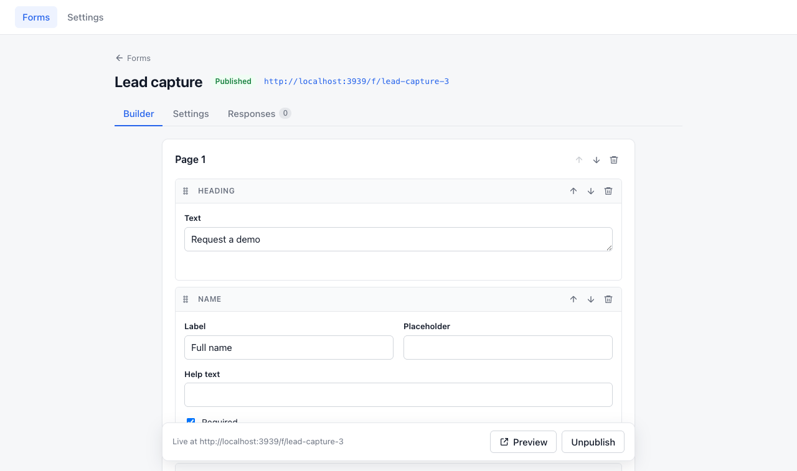
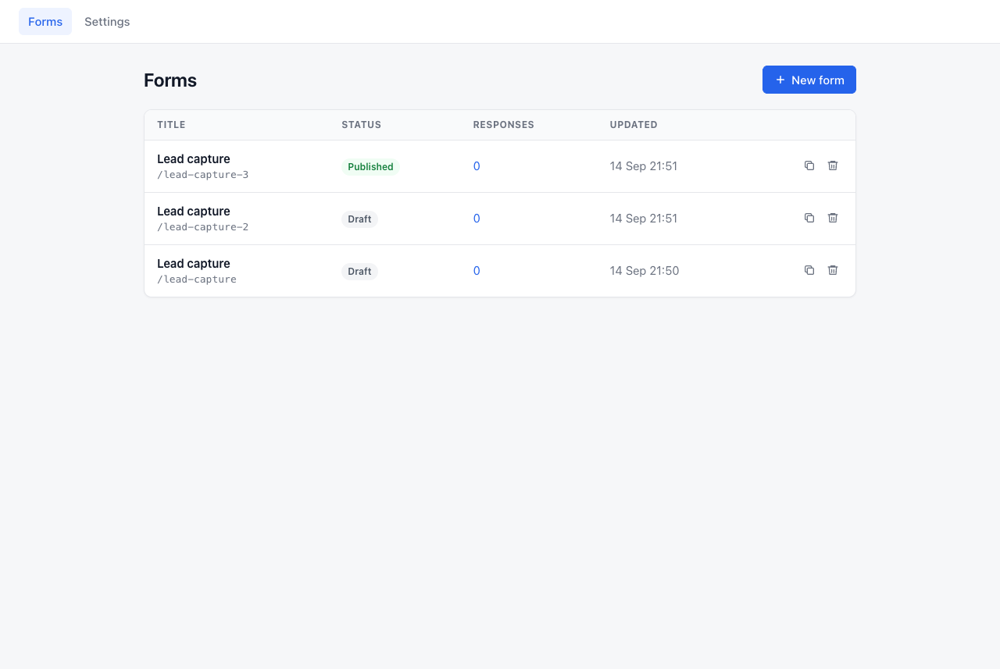
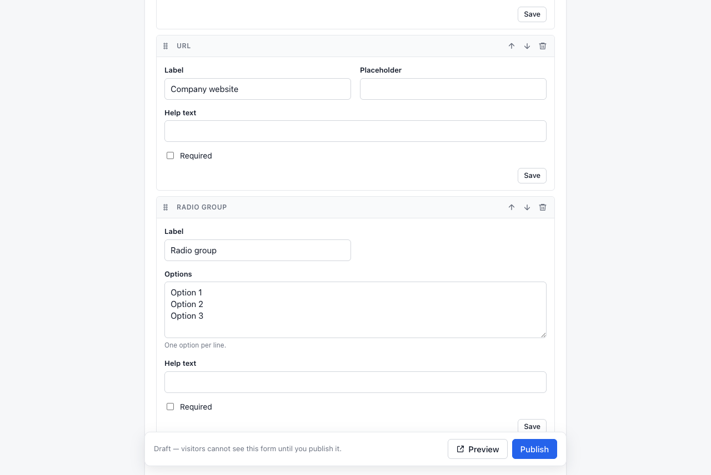
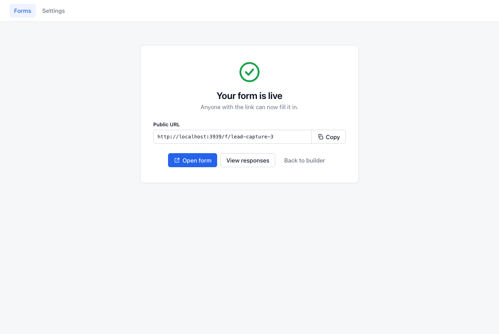
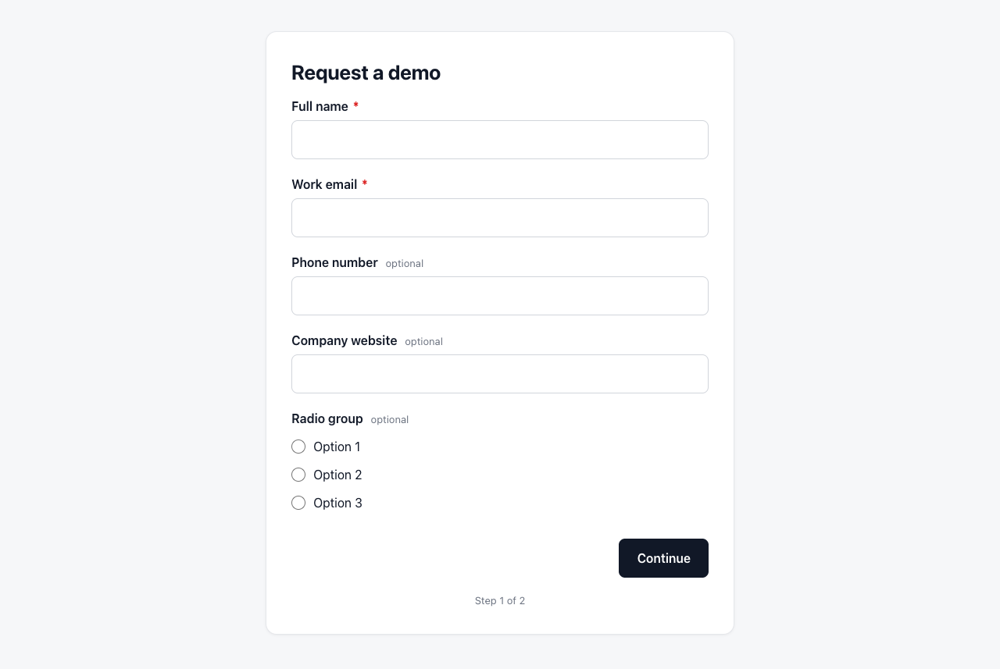
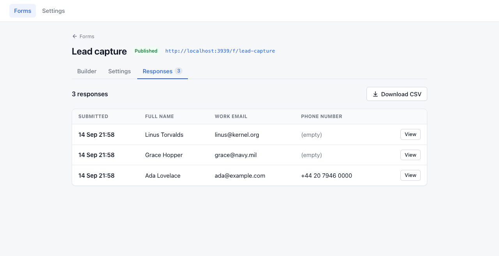
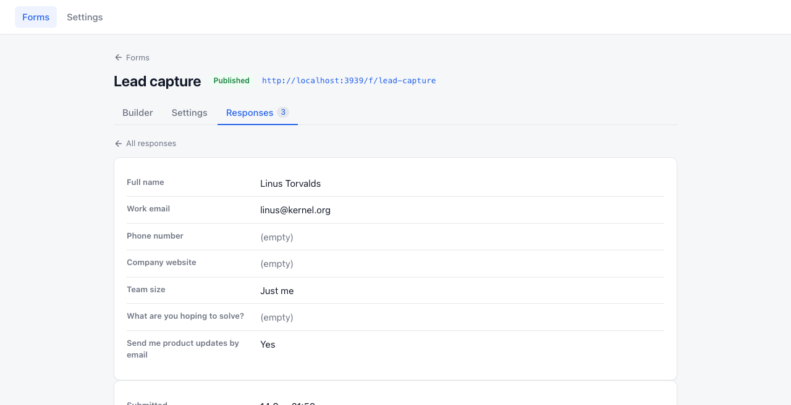
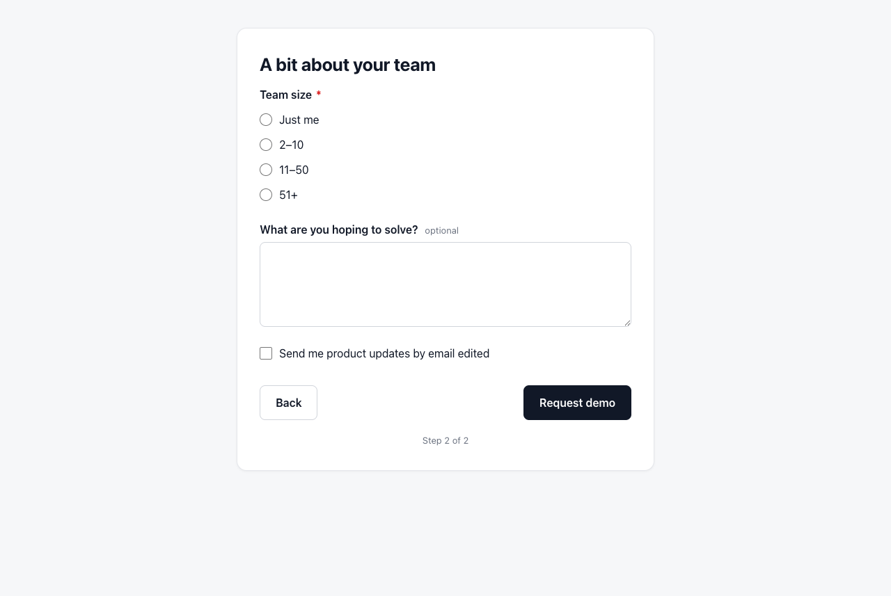
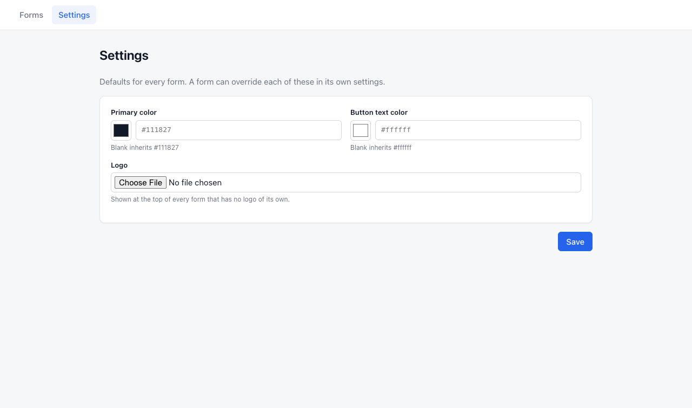

# formblocks

[](https://github.com/michaelkoper/formblocks/actions/workflows/ci.yml)
[](MIT-LICENSE)

**A form builder for Rails.** Multi-page forms built from blocks, published
at a public URL, responses in your own database. A self-hosted replacement
for a hosted form service, for the forms your app already needs: contact,
lead capture, feedback, signups.



## Install

```ruby
# Gemfile
gem "formblocks"
```

```bash
bundle install
bin/rails generate formblocks:install
bin/rails db:migrate
```

The generator writes the initializer, the migration, and one line in
`config/routes.rb`:

```ruby
mount_formblocks at: "/forms", public_at: "/f"
```

`at:` is the admin — the forms list, the builder, responses and settings.
`public_at:` is where published forms are served, as `/f/<slug>`. The two are
separate on purpose, so `/forms` can sit behind your admin while `/f/contact`
stays open to the world. Both are generator options too:

```bash
bin/rails generate formblocks:install --mount-path=/admin/forms --public-path=/forms
```

Open `/forms` in development and build something. Optional demo data —
three forms from the built-in templates, two of them published with a few
responses:

```bash
bin/rails formblocks:seed_demo
```

> [!IMPORTANT]
> The admin defaults to **development only**. Set `authorize_admin` before
> you deploy — see [Configure](#configure). With Devise:
>
> ```ruby
> # config/initializers/formblocks.rb
> Formblocks.configure do |config|
>   config.authorize_admin = ->(request) { request.env["warden"]&.user&.admin? }
> end
> ```

Ruby >= 3.2 · Rails >= 8.0 and < 9 · Active Storage only if you want logo and
image uploads — see [Uploads](#uploads-active-storage). The generator never
touches Active Storage tables: an app that has them gets uploads, an app
without them gets every other feature.

Installing with a coding agent? Point it at [AGENTS.md](AGENTS.md) — the same
steps in the order an agent needs them, plus the things it should not do. It
ships inside the gem, so `cat "$(bundle show formblocks)/AGENTS.md"` works from
any app that bundles it.

## What you get

|                  |                                                                                   |
| ---------------- | --------------------------------------------------------------------------------- |
| **Builder**      | Pages of blocks. Drag to reorder, autosave, click the button to rename it          |
| **Blocks**       | Heading, paragraph, image · name, email, phone, URL, text, textarea, hidden, checkbox, radio group |
| **Multi-page**   | Every form has at least one step and a thank-you page; add steps as you like      |
| **Templates**    | Blank, contact, lead capture, feedback — or your own hashes. Duplicate any form    |
| **Public page**  | One step at a time, browser validation, server validation with inline errors      |
| **Prefill**      | Fill any field from the link, hidden or visible, under opaque field IDs — the URL never says what a field is called |
| **Responses**    | A dashboard per form, one response in full, CSV export, an `on_submit` hook       |
| **Branding**     | Logo, primary color, button text color — per form, inherited from global settings |
| **Deps**         | Rails, `turbo-rails`, `stimulus-rails`. No asset pipeline, no bundler, no build step |
| **Auth**         | Lambdas over the raw request — Devise, Rails 8 auth, anything                     |
| **Turbo/CSP**    | Turbo 8 morphing in the builder, nonce-based CSP on every page                    |

## Why self-host it

|                                  | `formblocks`                          | A hosted form builder           |
| -------------------------------- | ------------------------------------- | ------------------------------- |
| Cost                             | Free, MIT                             | Monthly subscription            |
| Where responses live             | Your database                         | The vendor's                    |
| Reacting to a submission         | `config.on_submit`, a Ruby lambda     | Webhooks and a Zapier plan      |
| The public page                  | Your domain, your logo, no badge      | Their domain or a CNAME add-on  |
| Page weight                      | One stylesheet, one small module      | Third-party bundle + tracking   |
| If the vendor disappears         | Nothing happens                       | You lose the forms and the data |

## The whole flow

| 1. Pick a template, or start blank | 2. Build it from blocks |
| --- | --- |
|  |  |
| Every form starts with one step and a thank-you page. | Every change autosaves. The button at the bottom of a page is edited in place. |
| **3. Publish** | **4. Visitors fill it in, one step at a time** |
|  |  |
| Preview a draft any time; nobody else can see it until you publish. | Required fields are checked before the next step; the server checks again. |
| **5. Read the responses** | **6. Or download them** |
|  |  |
| The first three inputs as columns, newest first. | Every answer, plus where the visitor came from. CSV has one column per input. |

## Configure

Everything is optional — a fresh install works with zero config. In
`config/initializers/formblocks.rb`:

| Option | Default | What it does |
| --- | --- | --- |
| `app_name` | Rails app name | Shown in page titles ("Contact form · Nusii") and as the logo's alt text |
| `authorize_admin` | development only | **Who can build forms and read responses.** Override before deploying |
| `base_controller_class` | `ActionController::Base` | The controller the admin inherits — name your admin's and it adopts its layout, helpers and auth |
| `admin_layout` | the gem's own | Just the shell, if you don't want the whole controller |
| `tenant` | `nil` | One set of forms per tenant — see [Multi-tenancy](#multi-tenancy) |
| `on_submit` | no-op | Runs after each saved response — email, Slack, CRM |
| `attachments` | `true` | Logo and image uploads (needs Active Storage) |
| `max_upload_size` | `5.megabytes` | Enforced server-side |
| `storage_service` | app default | Active Storage service for uploads (a `storage.yml` key) |
| `default_primary_color` | `"#111827"` | When neither the form nor the settings page set one |
| `default_button_text_color` | `"#ffffff"` | Same, for the text on the button |
| `templates` | contact, lead, feedback | The "New form" page — see [Templates](#templates-and-duplication) |
| `rate_limit` | `{ to: 10, within: 1.minute }` | Per-IP throttle on submit. `nil` disables |
| `mount_path` | `"/forms"` | Written by `mount_formblocks`; set only if you mount by hand |
| `public_path` | `"/f"` | Same, for the public pages |

A typical initializer, with Devise:

```ruby
Formblocks.configure do |config|
  config.app_name        = "Nusii"
  config.authorize_admin = ->(request) { request.env["warden"]&.user&.admin? }
  config.on_submit       = ->(response) { LeadMailer.new_response(response).deliver_later }
  config.storage_service = :cloudinary_forms
end
```

Gates receive the **raw request**, so they work with any auth:

```ruby
# Devise / Warden
config.authorize_admin = ->(request) { request.env["warden"]&.user&.admin? }

# Rails 8 built-in auth (bin/rails generate authentication)
config.authorize_admin = lambda do |request|
  token = request.cookies["session_id"]
  Session.find_signed(token)&.user&.admin? if token
end

# Behind a network or a header
config.authorize_admin = ->(request) { request.headers["X-Admin-Token"] == Rails.application.credentials.admin_token }
```

<details>
<summary><b>Inside your own admin</b></summary>

Two ways. The layout only:

```ruby
config.admin_layout = "admin/application"
```

The engine's stylesheet, script and navigation are declared by its views,
not its layout, so they survive the swap. Or the whole stack:

```ruby
config.base_controller_class = "Admin::BaseController"
```

The admin controllers then inherit from your class and pick up its
authentication, helpers, layout and whatever request context its
`before_action`s establish. `authorize_admin` still runs as a last gate, so
widen it (`->(_request) { true }`) if your base controller already does the
work. Only the admin inherits it; the public pages stay on the engine's own
controller, so a visitor filling in a form is never asked for a staff session.

Your layout already loads Turbo and Stimulus? The engine notices Turbo and
keeps yours. Its Stimulus controllers run on their own application with
`fb-` prefixed identifiers, so the two never register the same name.

</details>

## Blocks

Every block is a Ruby class under `Formblocks::Blocks`, single-table
inheritance, so `Email < Text < Input < Block`:

| Kind | Stores | Notes |
| --- | --- | --- |
| `heading`, `paragraph` | — | Content. Allowed on the thank-you page |
| `image` | — | An upload; `label` is the alt text |
| `name`, `email`, `phone`, `url`, `text` | a string | Single-line inputs with the right `type` and `autocomplete`; email and URL are validated |
| `textarea` | a string | Multi-line |
| `hidden` | a string | `key` is the field name, `content` the default; the link to the form can override it — see [Filling fields from the URL](#filling-fields-from-the-url) |
| `checkbox` | `true`/`false` | Required means it must be ticked |
| `radio_group` | one of `options` | One option per line in the builder |

Every input has a **key** — from its label when it is created ("Work email"
→ `work_email`), unique within the form, and stable afterwards even if the
label changes; **Field name** in the builder renames it. Answers are stored
under it: `response.answers["work_email"]`.

<details>
<summary><b>Your own block</b></summary>

```ruby
# app/models/rating.rb
class Rating < Formblocks::Blocks::Input
  def self.placeholder? = false

  def validate_present_answer(value, errors)
    errors.add(key.to_sym, "must be 1 to 5") unless (1..5).cover?(value.to_i)
  end
end

# config/initializers/formblocks.rb
Rails.application.config.to_prepare do
  Formblocks::Block.register "Rating"
end
```

Then a public partial at
`app/views/formblocks/public/blocks/_rating.html.erb` (the built-in ones live
at the same path inside the gem) and a name under `formblocks.blocks.rating.name`
in your locale. Override `default_attributes` for what a freshly added block
looks like, `normalize_answer` for how a value is stored, `display_answer` for
how the dashboard and the CSV show it.

</details>

## Templates and duplication

The "New form" page offers a blank form and every entry in `config.templates`.
Three ship with the gem — contact, lead capture, feedback — as plain hashes,
so yours look the same:

```ruby
config.templates["webinar"] = {
  title: "Webinar signup",
  description: "Name and email, one page.",
  pages: [
    { button_text: "Save my seat",
      blocks: [
        { type: "heading", content: "Join us on Thursday" },
        { type: "name", label: "Name", required: true },
        { type: "email", label: "Email", required: true }
      ] }
  ],
  thank_you: { blocks: [{ type: "heading", content: "See you there!" }] }
}
config.templates.delete("feedback")
```

`Formblocks::Form.from_template(definition, tenant:)` builds a form from one
in code. `form.duplicate` deep-copies any form — pages, blocks, logo, images —
into a new draft with a fresh slug, which is the other way to make a template:
build one form well and copy it.

## The public page

A form is served at `#{public_path}/#{slug}` once published. A draft answers
404 — unless an admin opens it with `?preview=1`, which is what the builder's
Preview button does.



The page is standalone: its own layout, its own stylesheet, your logo, your
colors — as CSS custom properties in a nonced `<style>`, no inline style
attributes, so it works under a strict Content Security Policy. Steps are
`<fieldset>`s; a small Stimulus controller shows one at a time, validates it
with the browser's own constraint validation on **Next**, and opens the step a
server-side error belongs to. Without JavaScript every step is visible and the
form still submits as one.

Every submission is validated on the server against the form's blocks —
required fields, email and URL formats, radio options, required checkboxes —
and re-rendered with an error under each field. The slug is yours to set in
the form's settings; it is generated from the title otherwise.

### Filling fields from the URL

A link can carry answers with it: who is asking, which plan they are on, the
email you already know. Every input — hidden or visible — has an **ID**, a
short opaque string, and a query parameter with that name fills the field:

```
/f/feedback?515e541fe571=7&d42b3cfb4220=ada%40example.com
```

The visitor sees the values, not what they are stored as. **Copy ID** on a
block in the builder gives you its ID; it stays the same for the life of the
block, whatever its label and field name become.

From your own views, write the keys and let the gem look the IDs up:

```erb
<%= link_to "Request an integration",
      formblocks_form_path("request-for-integration",
        Formblocks.prefill("request-for-integration",
          user_id: Current.user.id, account_id: Current.account.id,
          role: Current.account.role, email: Current.user.email)),
      target: "_blank" %>
```

`Formblocks.prefill(slug, answers)` is one query and returns `{ id => value }`.
A key the form does not have is left out, so the link survives a field being
renamed or removed. IDs belong to a database — the same form built in staging
and in production has different ones — which is the other reason to use the
helper rather than paste IDs into code.

A field also answers to its plain key, `?utm_source=newsletter`, for the
parameters whose names you do not choose. A radio group takes one of its
options, a checkbox `1` or `0`. Anything in a URL can be edited by the
visitor, so treat a prefilled answer like any other answer: it says what the
link said, not who the visitor is.

### Spam and rate limiting

Two defences, both on by default and neither visible to a person:

- **A honeypot.** The form carries a text field no human sees. A bot that
  fills it in gets the thank-you page and nothing is stored.
- **A per-IP rate limit** on the submit endpoint: 10 submissions a minute
  from one address by default. Past that the visitor gets the form back with
  their answers kept, a "too many submissions" message, and a 429 status. It
  uses the rate limiter built into Rails, backed by `Rails.cache`, so the
  counter needs a cache store shared across your processes (Solid Cache,
  Redis, Memcached — not the per-process memory store) to count correctly.

```ruby
config.rate_limit = { to: 3, within: 10.minutes }  # stricter
config.rate_limit = nil                             # off
```

The value is read once, when the controller loads, so set it in the
initializer. Only the public submit is throttled; the admin never is.

## Responses

`Formblocks::Response` belongs to a form: `answers` (a hash keyed by block
key), `page_url` (where the visitor came from), `user_agent`, `locale`, and a
`tenant` copied from the form. `config.on_submit` receives each one right
after it is saved:

```ruby
config.on_submit = lambda do |response|
  Lead.create!(email: response.answers["work_email"], name: response.answers["full_name"],
               source: response.form.slug)
end
```

The dashboard lists them fifty at a time, shows one in full — a URL answer
that points at an image appears as a thumbnail linking to the picture — and
**Download CSV** exports every response with one column per input — plus a column for
any key a since-deleted block left behind, so nothing collected is lost. Cells
a spreadsheet would run as formulas are escaped.

## Branding

Each form has a logo, a primary color and a button text color. Leave any of
them blank and it inherits from the **Settings** page — one set of defaults
per tenant — and, failing that, from `default_primary_color` and
`default_button_text_color`. The builder previews the button in the resolved
colors.



## Uploads (Active Storage)

Three things are uploads: a form's logo, the global logo on the Settings
page, and the image block. All three are plain `has_one_attached`
attachments on the engine's own models, stored by the host's Active Storage
and served through the host's Active Storage routes — the engine adds no
storage of its own.

**It is optional.** The install generator never creates Active Storage
tables, because most apps already have them, and it never asks for them
either: `bin/rails db:migrate` after the install succeeds with or without
them. Without Active Storage — the gem not loaded, or
`config.attachments = false` — the logo fields and the image block's upload
disappear from the builder and the settings page, and everything else works
as before. To add it to an app that lacks it, run Rails' own installer:

```bash
bin/rails active_storage:install
bin/rails db:migrate
```

The `formblocks_*` tables follow your app's `config.generators` primary key
type, the same way Rails' own Active Storage migration does — so on a
uuid-keyed app the tables are uuid-keyed too and attachments line up with
`active_storage_attachments.record_id`.

**Where files go.** By default, the environment's default service. To keep
form media apart from the rest of your library, name a service from
`config/storage.yml` — a dedicated bucket or folder, or an entry carrying
provider options such as Cloudinary's `folder:` and `tags:`:

```yaml
# config/storage.yml
cloudinary_forms:
  service: Cloudinary
  folder: Forms
  tags: formblocks
```

```ruby
# config/initializers/formblocks.rb
config.storage_service = :cloudinary_forms
```

The name is read when the models load, after your initializers, and a name
that is not in `storage.yml` fails at boot rather than at the first upload.

**What is checked.** An upload must be an image (`image/*`) and at most
`config.max_upload_size` (5 MB by default); anything else is refused with a
validation error and nothing is stored. Each attachment has a matching
"Remove" checkbox in the UI, which purges the file on save. Duplicating a
form copies its logo and images as new blobs rather than sharing them, so
purging one form's file never takes it away from the other.

| Option | Default | |
| --- | --- | --- |
| `attachments` | `true` | `false` hides every upload, even with Active Storage loaded |
| `max_upload_size` | `5.megabytes` | Per file, enforced server-side |
| `storage_service` | app default | A `config/storage.yml` key |

## Multi-tenancy

Scope forms, responses and settings to a tenant — each Account (or
Organization, Store, Site) with its own forms and its own dashboard — with
one resolver:

```ruby
config.tenant = ->(request) { Current.account&.to_gid&.to_s }
```

Return an **opaque key**: a GlobalID, an id, a subdomain, a slug. The gem
never takes a foreign key into your models. It stamps the key on each form
and response and scopes every admin read and write, so an admin only ever
sees their tenant's forms. `nil` — the default — is a single global
collection, so single-tenant apps need none of this.
`Formblocks.for(account)` returns that record's forms.

Slugs stay global: a public URL has no tenant in it, so two tenants cannot
both own `/f/contact`. The second gets `contact-2` and can pick another slug
in the form's settings.

## Assets, Turbo and Stimulus

The engine serves its own stylesheet and JavaScript from
`#{mount_path}/assets/` with content fingerprints in the URLs and a year of
caching. Turbo and Stimulus are served the same way, straight from the
`turbo-rails` and `stimulus-rails` gems the engine depends on — so your
bundle decides their versions and nothing goes through the host's asset
pipeline, importmap or bundler. A host with Sprockets, Propshaft, esbuild,
importmap, or no JavaScript setup at all all get the same builder.

## Who's using it

- [Nusii](https://nusii.com) — proposal software

Shipping it? [Open a PR](https://github.com/michaelkoper/formblocks/pulls) and
add yourself.

## Development

The gem carries a small Rails app in `test/dummy` — the same app the tests
run against — and `bin/rails` at the gem root drives it, so you can try the
builder without installing the gem anywhere:

```bash
bin/rails db:migrate                 # the dummy app's database (SQLite, in test/dummy/storage)
bin/rails app:formblocks:seed_demo   # optional: three forms and a few responses
bin/rails server                     # http://localhost:3000/forms — no login, it is development
```

Inside the gem, the app's own rake tasks sit under `app:` — that is why the
seed task is `app:formblocks:seed_demo` here and plain `formblocks:seed_demo`
in a host. The dummy app has Active Storage, so logos and image blocks work,
and a strict nonce-based Content Security Policy, so anything that needed an
inline style or script would show up right away.

```bash
bundle exec rake test            # models, requests, generator
bundle exec rake test:system     # the builder and the public form in headless Chrome
bundle exec rubocop
node --check lib/formblocks/assets/admin.js lib/formblocks/assets/public.js
```

The default suite covers every admin and public request, the models and the
generator. The system task drives a real headless Chrome through the palette,
autosave, publishing and a two-step submission. CI runs Rails 8.0 and 8.1
against Ruby 3.2 through 4.0.

Bug reports and pull requests welcome.

## Credits

Highly inspired by [testimonials](https://github.com/yshmarov/testimonials)
by [Yaroslav Shmarov](https://github.com/yshmarov).

## License

MIT.
